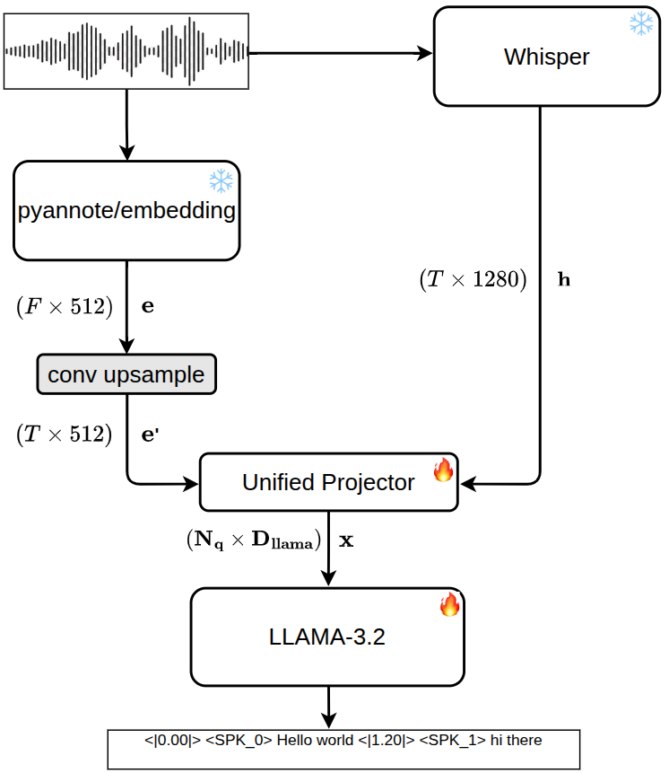

<div align="center">
<h1 style="border-bottom: none; margin-bottom: 0px ">PyannoteAI-enabled SpeechLLM for SA-ASR</h1>

[**Artem Fedorchenko**](https://scholar.google.com/citations?user=9dsO2ssAAAAJ&hl=en)

</div>

This repository contains code and instructions for using **PyannoteAI-enabled SpeechLLM** for Speaker-Attributed Automatic Speech Recognition (SA-ASR). The model integrates speaker embedding extraction capabilities from PyannoteAI with advanced speech recognition by OpenAI's Whisper to provide accurate transcriptions along with speaker attributions. In the attempt to lessen the number of trainable parameters, the provided implementation has yileded two crucial insights:

- 💎 A **unified modality adapter (projector)**: combines speech encodings with speaker embeddings before LLAMA autoregresive decoding.
- ✨ **LoRA-tuned LLAMA-3.2** : leverages Low-Rank Adaptation (LoRA) to fine-tune LLAMA-3.2 with extended vocabulary for the SA-ASR task.

⚡ **Versatility of the Approach** <br>
Because of the underlying LLM usage, the proposed method could be used to do a variety of tasks simultaneously related to speech such as:
- Transcript summarization
- Keyword extraction
- Topic segmentation
- Translation
- And more...

## 📍Architecture Overview
<p align="center">
 
</p>


## 🔎 Projector Module
<p align="center">
 
</p>

Both speaker projector and speech projector modules are implemented as Qformer networks.


## 🚀 Train on a Specific Dataset

### Prerequisites
- Python 3.10+
- FFmpeg (audio processing)

```bash
# Ubuntu/Debian
sudo apt-get install ffmpeg
# MacOS
brew install ffmpeg
```
### 📦 Installation

The project uses [`uv`](https://docs.astral.sh/uv/#installation) for fast dependcency management.
```bash
git clone git@github.com:fdorch/guided-modality-adapter.git
cd guided-modality-adapter
uv sync
source .venv/bin/activate
```
However, if you prefer using `pip` and `conda`, you can install the required dependencies as follows:

```bash
conda create -n guided-modality-adapter python=3.10
conda activate guided-modality-adapter
pip install -r requirements.txt
```


### 📚 Download needed dataset & extract

```bash
uv run --active python scripts/download.py --url <URL_OF_THE_FILE> --download_dir <TARGET_DIRECTORY>
```

### 🔧 Convert dataset into `.jsonl` entries

```bash
{"audio_path": "data/audio/utt1.wav", "transcript": "hello world", "timestamps": [0.0, 1.2], "speaker_segments": [[0.0, 1.2, 0]]}
```
### 📐 Fill in configuration files
Modify the configuration files located in the `configs/` directory to specify dataset paths, model parameters, and training settings.

```bash
data:
  root_dir: "data"              # where download.py put things, e.g. data/
  train_manifest: "train.jsonl" # relative to root_dir
  val_manifest: "val.jsonl"     # relative to root_dir
  sample_rate: 16000
  batch_size: 4
  num_workers: 4
```

### 🏋️‍♂️ Start Training
```bash
uv run --active python run.py
```
